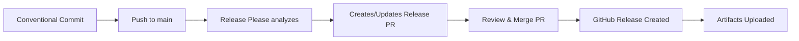

# Contributing to ServiceNow AI Infrastructure

Thank you for your interest in contributing! This document provides guidelines for contributing to this project.

---

## 📋 Table of Contents

- [Code of Conduct](#code-of-conduct)
- [Getting Started](#getting-started)
- [Conventional Commits](#conventional-commits)
- [Development Workflow](#development-workflow)
- [Pull Request Process](#pull-request-process)
- [Testing Guidelines](#testing-guidelines)
- [Release Process](#release-process)

---

## Code of Conduct

This project adheres to a code of conduct. By participating, you are expected to uphold this code.

---

## Getting Started

### Prerequisites

- Terraform >= 1.0
- Google Cloud SDK
- kubectl
- Docker
- GitHub CLI (optional)

### Setup

1. **Clone the repository**:
   ```bash
   git clone https://github.com/YOUR_ORG/servicenow-ai.git
   cd servicenow-ai
   ```

2. **Install dependencies**:
   ```bash
   # Install Terraform
   brew install terraform

   # Install gcloud
   brew install google-cloud-sdk

   # Install kubectl
   brew install kubectl
   ```

3. **Configure GCP credentials**:
   ```bash
   gcloud auth application-default login
   gcloud config set project YOUR_PROJECT_ID
   ```

---

## Conventional Commits

This project uses **[Conventional Commits](https://www.conventionalcommits.org/)** for automated versioning and changelog generation.

### Commit Message Format

```
<type>[optional scope]: <description>

[optional body]

[optional footer(s)]
```

### Commit Types

| Type | Description | Version Bump |
|------|-------------|--------------|
| `feat` | A new feature | Minor (0.x.0) |
| `fix` | A bug fix | Patch (0.0.x) |
| `docs` | Documentation only changes | None |
| `style` | Code style changes (formatting, etc.) | None |
| `refactor` | Code refactoring | None |
| `perf` | Performance improvements | Patch |
| `test` | Adding/updating tests | None |
| `build` | Build system changes | None |
| `ci` | CI/CD changes | None |
| `chore` | Other changes (dependencies, etc.) | None |
| `revert` | Revert a previous commit | Patch |

### Breaking Changes

Add `!` after the type or add `BREAKING CHANGE:` in the footer:

```bash
# Option 1: ! notation
feat!: remove support for Node 12

# Option 2: Footer notation
feat: update authentication flow

BREAKING CHANGE: API endpoints now require authentication header
```

**Result**: Major version bump (x.0.0)

### Examples

#### ✅ Good Commit Messages

```bash
# Feature (minor bump)
feat(gke): add autopilot mode support

# Bug fix (patch bump)
fix(vpc): correct firewall rule priority

# Breaking change (major bump)
feat(cloudsql)!: migrate to Cloud SQL v2 API

# Documentation (no bump)
docs: update deployment instructions

# Multiple changes
feat(workload-identity): add federation support

Adds Workload Identity Federation for GitHub Actions.
Includes keyless authentication and OIDC provider setup.

Closes #123
```

#### ❌ Bad Commit Messages

```bash
# Too vague
update files

# No type
added new feature

# Not following format
FIX: bug in vpc module
```

---

## Development Workflow

### 1. Create a Feature Branch

```bash
git checkout -b feat/your-feature-name
# or
git checkout -b fix/bug-description
```

### 2. Make Your Changes

- Follow Terraform best practices
- Add tests for new modules
- Update documentation

### 3. Test Your Changes

```bash
# Validate Terraform
terraform validate

# Run tests
terraform test

# Format code
terraform fmt -recursive
```

### 4. Commit Your Changes

```bash
# Stage changes
git add .

# Commit with conventional format
git commit -m "feat(module-name): add new feature"
```

### 5. Push and Create PR

```bash
git push origin feat/your-feature-name

# Create PR (using GitHub CLI)
gh pr create --title "feat: add new feature" --body "Description of changes"
```

---

## Pull Request Process

### PR Requirements

1. ✅ **Conventional Commit** title format
2. ✅ **Tests passing** - All Terraform tests must pass
3. ✅ **Code formatted** - Run `terraform fmt`
4. ✅ **Documentation updated** - Update README if needed
5. ✅ **No merge conflicts** - Rebase on latest main
6. ✅ **Review approved** - At least one approval required

### PR Title Format

Use conventional commit format for PR titles:

```
feat(gke): add workload identity support
fix(vpc): correct NAT gateway configuration
docs: update deployment guide
```

### PR Description Template

```markdown
## Description
Brief description of changes

## Type of Change
- [ ] Bug fix (patch)
- [ ] New feature (minor)
- [ ] Breaking change (major)
- [ ] Documentation update

## Testing
- [ ] Terraform validate passes
- [ ] Terraform test passes
- [ ] Manual testing completed

## Checklist
- [ ] Code follows project style
- [ ] Self-review completed
- [ ] Documentation updated
- [ ] Tests added/updated
```

---

## Testing Guidelines

### Terraform Module Tests

Each module should have a test file in `tests/basic.tftest.hcl`:

```hcl
# terraform/modules/example/tests/basic.tftest.hcl
mock_provider "google" {}

run "plan_example" {
  command = plan

  variables {
    project_id = "test-project"
    region     = "europe-west2"
  }

  assert {
    condition     = resource.google_example.main.name == "expected-name"
    error_message = "Resource name should match expected value"
  }
}
```

### Running Tests

```bash
# Validate all modules
terraform validate

# Test specific module
cd terraform/modules/gke
terraform test

# Test all modules
for module in terraform/modules/*/; do
  echo "Testing $module"
  (cd "$module" && terraform test)
done

# Format check
terraform fmt -check -recursive
```

---

## Release Process

This project uses **[Release Please](https://github.com/googleapis/release-please)** for automated releases.

### How Releases Work

1. **Commits are pushed to main** using conventional commit format
2. **Release Please analyzes commits** and determines version bump
3. **Release PR is created/updated** with:
   - Updated CHANGELOG.md
   - Version bumps in relevant files
   - Release notes
4. **Merge the Release PR** to:
   - Create GitHub release
   - Tag the release
   - Upload release artifacts

### Release Workflow



### Version Bumping

| Commit Type | Example | Version Change |
|-------------|---------|----------------|
| `fix:` | fix(vpc): correct subnet CIDR | 1.0.0 → 1.0.1 |
| `feat:` | feat(gke): add autopilot mode | 1.0.0 → 1.1.0 |
| `feat!:` | feat!: remove deprecated API | 1.0.0 → 2.0.0 |

### Manual Release Trigger

If needed, you can trigger a release manually:

```bash
# Using GitHub CLI
gh workflow run release-please.yml

# Or via GitHub UI
# Actions → Release Please → Run workflow
```

---

## Code Style Guidelines

### Terraform Style

- Use 2-space indentation
- Run `terraform fmt` before committing
- Use meaningful resource names
- Add comments for complex logic
- Follow module structure:
  ```
  module/
  ├── main.tf       # Main resources
  ├── variables.tf  # Input variables
  ├── outputs.tf    # Output values
  ├── versions.tf   # Provider versions
  └── tests/
      └── basic.tftest.hcl
  ```

### Documentation Style

- Use clear, concise language
- Include code examples
- Add diagrams where helpful
- Keep README.md up to date

---

## Branch Strategy

### Main Branches

- `main` - Production-ready code, protected branch
- `feat/*` - Feature branches
- `fix/*` - Bug fix branches
- `docs/*` - Documentation branches

### Branch Protection

The `main` branch is protected with:
- ✅ Require pull request reviews
- ✅ Require status checks to pass
- ✅ Require branches to be up to date
- ✅ Require conversation resolution
- ❌ No direct pushes allowed

---

## Getting Help

- 📖 Read the [Documentation](./README.md)
- 🐛 Open an [Issue](https://github.com/YOUR_ORG/servicenow-ai/issues)
- 💬 Start a [Discussion](https://github.com/YOUR_ORG/servicenow-ai/discussions)
- 📧 Contact maintainers

---

## License

By contributing, you agree that your contributions will be licensed under the same license as the project.

---

## Quick Reference

### Common Commands

```bash
# Conventional commit
git commit -m "feat(gke): add new node pool configuration"

# Run tests
terraform test

# Format code
terraform fmt -recursive

# Validate
terraform validate

# Create PR
gh pr create --title "feat: description" --body "Details"
```

### Useful Links

- [Conventional Commits](https://www.conventionalcommits.org/)
- [Semantic Versioning](https://semver.org/)
- [Release Please](https://github.com/googleapis/release-please)
- [Terraform Best Practices](https://www.terraform-best-practices.com/)

---

**Thank you for contributing! 🎉**
