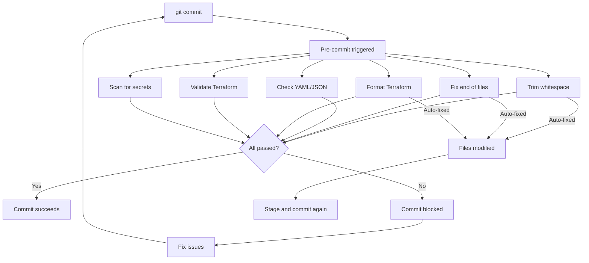

# Pre-Commit Quick Start

## ⚡ TL;DR

```bash
# Install hooks (one-time)
make pre-commit-install

# Test everything before committing
make pre-commit

# Quick check (no Terraform validate - faster)
make quick-check

# Commit normally (pre-commit runs automatically)
git commit -m "your message"
```

---

## 📋 Quick Reference

### Common Commands

| Command | What It Does | Speed |
|---------|-------------|-------|
| `make pre-commit` | Run all checks | ~15s |
| `make quick-check` | Fast checks only | ~3s |
| `make pre-commit-terraform` | Terraform only | ~12s |
| `make pre-commit-secrets` | Scan for secrets | ~2s |
| `make terraform-test` | Run all tests | ~30s |
| `make ci` | Full CI simulation | ~45s |

### First-Time Setup

```bash
# 1. Install pre-commit hooks
make pre-commit-install

# 2. Test it works
make quick-check

# 3. You're ready!
```

---

## 🚀 Typical Workflow

### Option 1: Let Pre-Commit Handle It (Recommended)

```bash
# Make changes
vim terraform/modules/vpc/main.tf

# Stage changes
git add terraform/modules/vpc/main.tf

# Commit (pre-commit runs automatically)
git commit -m "feat: add VPC peering"

# If files were auto-fixed, stage and commit again
git add -u
git commit -m "feat: add VPC peering"
```

### Option 2: Test First, Then Commit

```bash
# Make changes
vim terraform/modules/vpc/main.tf

# Test before staging
make quick-check

# Stage and commit
git add terraform/modules/vpc/main.tf
git commit -m "feat: add VPC peering"
```

---

## 🔧 What Gets Checked

### ✅ Automatic Fixes (These fix themselves)

- Trailing whitespace removed
- Missing newlines added at end of files
- JSON files formatted
- Terraform files formatted

### 🔍 Validation (These fail if issues found)

- YAML syntax
- JSON syntax
- Terraform syntax
- Secrets detection (API keys, tokens, etc.)

---

## 🆘 Common Issues

### "Hook failed but files were modified"

**This is normal!** Pre-commit fixed issues automatically.

```bash
# Just stage the fixed files and commit again
git add -u
git commit -m "your message"
```

### "Terraform validate failed"

```bash
# Check which module failed
cd terraform/modules/failed-module

# Test manually
terraform init
terraform validate

# Fix the issue
vim main.tf

# Try again
make pre-commit
```

### "Detected secrets"

```bash
# Review what was detected
pre-commit run detect-secrets --all-files

# If it's a false positive, update baseline
detect-secrets scan --update .secrets.baseline

# If it's real, remove it and use environment variables instead
```

### Skip Pre-Commit (Emergency Only!)

```bash
# Skip ALL checks (not recommended!)
git commit --no-verify -m "emergency fix"

# Skip specific check
SKIP=terraform_validate git commit -m "WIP"
```

---

## 📊 What Happens During Pre-Commit



---

## 🎯 Best Practices

### ✅ Do

```bash
# Test before opening PR
make pre-commit

# Or simulate full CI
make ci

# Fix issues, don't skip hooks
make quick-check
# fix issues
git commit
```

### ❌ Don't

```bash
# Don't skip hooks for normal commits
git commit --no-verify  # ❌

# Don't commit secrets
echo "API_KEY=abc123" >> config.yaml  # ❌
git commit  # ❌ Will be caught by detect-secrets
```

---

## 🔗 Related Files

- **Configuration:** `.pre-commit-config.yaml`
- **Makefile:** `Makefile` (helper commands)
- **Full Guide:** `.github/PRE_COMMIT_SETUP.md`
- **Secrets Baseline:** `.secrets.baseline`

---

## 💡 Pro Tips

### Speed Up Pre-Commit

```bash
# Only check files you changed
git add terraform/modules/vpc/*.tf
git commit  # Only checks staged files

# Skip expensive checks for WIP
SKIP=terraform_validate git commit -m "WIP"

# Use quick-check instead of full pre-commit
make quick-check
```

### Terraform-Specific

```bash
# Format all Terraform files
make terraform-fmt

# Validate all modules
make terraform-validate

# Run all tests
make terraform-test

# All three
make ci
```

### Update Hooks

```bash
# Update to latest versions
make pre-commit-update

# Review changes
git diff .pre-commit-config.yaml

# Test
make pre-commit

# Commit
git add .pre-commit-config.yaml
git commit -m "chore: update pre-commit hooks"
```

---

## 📈 Performance

On this project:

| Check | Time | Can Skip? |
|-------|------|-----------|
| Whitespace | 0.5s | ❌ Never |
| YAML/JSON | 0.5s | ❌ Never |
| Terraform fmt | 1s | ❌ Never |
| Secrets scan | 2s | ⚠️ Rarely |
| Terraform validate | 10s | ✅ For WIP |

**Total:** ~15s for full check, ~3s for quick check

---

## 🆘 Help

### Commands

```bash
# See all available commands
make help

# Run specific check
make pre-commit-terraform
make pre-commit-secrets

# Clean caches
make clean

# Setup from scratch
make dev-setup
```

### Documentation

- **Quick Start:** `PRE_COMMIT_QUICKSTART.md` (this file)
- **Full Guide:** `.github/PRE_COMMIT_SETUP.md`
- **Makefile:** `make help`

### Online Resources

- Pre-commit: https://pre-commit.com/
- Terraform hooks: https://github.com/antonbabenko/pre-commit-terraform

---

## ✅ Summary

**Pre-commit is set up and ready to use!**

1. ✅ Hooks installed (`make pre-commit-install`)
2. ✅ Configuration ready (`.pre-commit-config.yaml`)
3. ✅ Makefile for easy testing (`make pre-commit`)

**What to do now:**

```bash
# Test it
make quick-check

# Make some changes
vim terraform/modules/vpc/main.tf

# Commit (pre-commit runs automatically)
git commit -m "test: trying out pre-commit"

# Enjoy cleaner commits! 🚀
```
