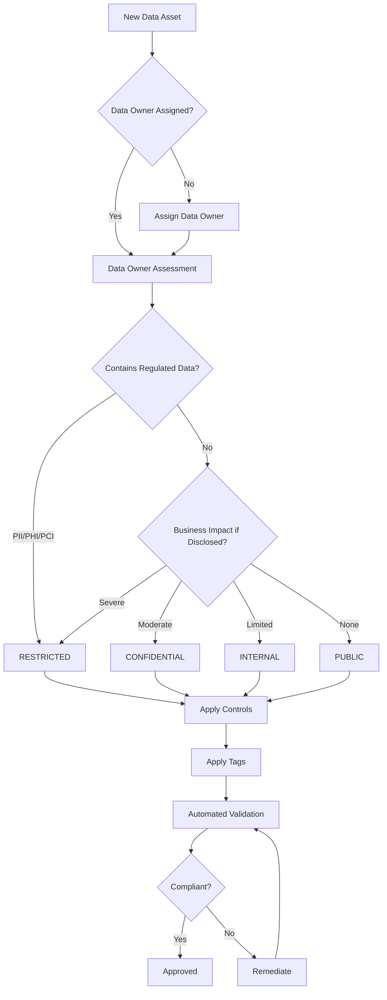

# Data Classification Policy
## Amazon Bedrock Agents Infrastructure

**Document Version:** 1.0
**Effective Date:** 2025-11-17
**Last Reviewed:** 2025-11-17
**Next Review:** 2026-11-17
**Policy Owner:** Chief Information Security Officer (CISO)
**Approved By:** Executive Leadership Team

---

## 1. Purpose

This Data Classification Policy establishes a framework for categorizing information assets based on their sensitivity, criticality, and regulatory requirements within the Amazon Bedrock Agents infrastructure. The policy ensures that appropriate security controls are applied to protect data throughout its lifecycle.

## 2. Scope

This policy applies to:
- All data processed, stored, or transmitted by Amazon Bedrock agents
- All knowledge bases containing organizational or customer information
- All AWS services supporting Bedrock agent operations
- All employees, contractors, and third parties accessing the infrastructure
- All environments (development, staging, production)

## 3. Data Classification Levels

### 3.1 PUBLIC (Level 0)

**Definition:** Information intended for public disclosure with no confidentiality requirements.

**Characteristics:**
- Can be freely distributed without authorization
- No adverse impact if disclosed
- Marketing materials, public documentation

**Security Controls:**
- Integrity verification
- Version control
- No encryption required

**AWS Implementation:**
- S3 bucket: Public read access allowed
- CloudFront distribution allowed
- No data residency restrictions

**Bedrock Context:**
- Public knowledge base content
- General information responses
- Published API documentation

**Tagging Requirements:**
```yaml
Classification: Public
Confidentiality: None
Integrity: Standard
Availability: Standard
```

**Retention:** As per business requirements

---

### 3.2 INTERNAL (Level 1)

**Definition:** Information intended for internal use only, not sensitive but not for public disclosure.

**Characteristics:**
- General business information
- Internal communications
- Operational data
- Limited impact if disclosed

**Security Controls:**
- Access authentication required
- Basic access controls (IAM policies)
- Standard backup procedures
- Audit logging enabled

**AWS Implementation:**
- S3 bucket: Block public access
- IAM policies: Organization-wide access
- Encryption at rest: AWS-managed keys (SSE-S3)
- VPC endpoints: Optional
- CloudTrail: Data events logged

**Bedrock Context:**
- Internal knowledge bases
- Employee-facing agent responses
- Operational prompts and configurations
- Non-sensitive training data

**Tagging Requirements:**
```yaml
Classification: Internal
Confidentiality: Low
Integrity: Standard
Availability: Standard
DataOwner: [Department]
```

**Retention:** 3 years minimum

---

### 3.3 CONFIDENTIAL (Level 2)

**Definition:** Sensitive business information requiring protection from unauthorized disclosure.

**Characteristics:**
- Business plans and strategies
- Financial reports
- Customer information (non-regulated)
- Employee data (non-PII)
- Proprietary information
- Moderate to significant impact if disclosed

**Security Controls:**
- Strong authentication (MFA required)
- Role-based access control (RBAC)
- Encryption at rest with customer-managed keys (CMK)
- Encryption in transit (TLS 1.2+)
- Data loss prevention (DLP) monitoring
- Quarterly access reviews
- Enhanced audit logging

**AWS Implementation:**
- S3 bucket:
  - Block all public access
  - Bucket versioning enabled
  - MFA delete enabled
  - SSE-KMS encryption with CMK
  - SSL/TLS required
- KMS:
  - Customer-managed key
  - Key rotation enabled
  - Key policy restrictive
- IAM:
  - Least privilege access
  - MFA required for access
  - Access Analyzer enabled
- VPC:
  - VPC endpoints required
  - Private subnets only
  - Security groups restrictive
- CloudTrail:
  - Management and data events
  - Log file validation enabled
  - Logs encrypted
- GuardDuty: Enabled for threat detection
- Macie: Sensitive data discovery enabled

**Bedrock Context:**
- Customer interaction history
- Business-critical knowledge bases
- Strategic planning agents
- Competitive intelligence data
- Agent configuration containing business logic
- Model fine-tuning data (proprietary)

**Bedrock-Specific Controls:**
- Bedrock knowledge base:
  - Encrypted with CMK
  - VPC endpoint access only
  - IAM authentication required
  - Invocation logging enabled
- Bedrock agents:
  - Private subnet deployment
  - Guardrails configured
  - Input/output filtering
  - Session data encryption

**Tagging Requirements:**
```yaml
Classification: Confidential
Confidentiality: High
Integrity: High
Availability: High
DataOwner: [Executive Owner]
ComplianceFramework: [SOC2, ISO27001]
BackupRequired: true
DLPEnabled: true
```

**Retention:** 7 years minimum

---

### 3.4 RESTRICTED (Level 3)

**Definition:** Highly sensitive information subject to regulatory requirements or causing severe impact if disclosed.

**Characteristics:**
- Personally Identifiable Information (PII)
- Protected Health Information (PHI)
- Payment Card Information (PCI)
- Trade secrets
- Legal privileged information
- Authentication credentials
- Cryptographic keys
- Severe to catastrophic impact if disclosed

**Security Controls:**
- Multi-factor authentication (MFA) mandatory
- Attribute-based access control (ABAC)
- Encryption at rest with CMK and key policies
- Encryption in transit with mutual TLS
- Field-level encryption where applicable
- Data masking and tokenization
- DLP with automated blocking
- Real-time monitoring and alerting
- Monthly access reviews
- Comprehensive audit logging (all actions)
- Data residency controls
- Breach notification procedures
- Privacy impact assessments

**AWS Implementation:**
- S3 bucket:
  - Block all public access
  - Bucket versioning enabled
  - MFA delete required
  - Object Lock enabled (compliance mode)
  - SSE-KMS with CMK + bucket keys
  - SSL/TLS required
  - Access logging to separate bucket
  - Cross-region replication (encrypted)
- KMS:
  - Customer-managed key (CMK)
  - Automatic key rotation enabled
  - Key policy with least privilege
  - Key usage logging
  - No key export capability
  - Separate keys per data category
- IAM:
  - Least privilege access (minimal users)
  - MFA required for all access
  - Session duration limited (1 hour)
  - Access Analyzer external access alerts
  - IAM Access Analyzer policy validation
- VPC:
  - VPC endpoints mandatory (AWS PrivateLink)
  - Private subnets only
  - No internet gateway access
  - Security groups: whitelist only
  - Network ACLs: restrictive
  - VPC Flow Logs enabled
  - Network Firewall for inspection
- CloudTrail:
  - Management and data events (all)
  - Log file validation enabled
  - Logs encrypted with KMS
  - Logs to dedicated account
  - Real-time log analysis
- GuardDuty:
  - Enabled with S3 protection
  - Malware protection enabled
  - Critical findings auto-remediated
- Macie:
  - Automated discovery jobs daily
  - Custom data identifiers for PII/PHI/PCI
  - Sensitive data inventory maintained
  - Findings exported to Security Hub
- Security Hub:
  - Automated compliance checks
  - PCI DSS standard enabled
  - HIPAA compliance checks
  - GDPR controls verified
  - Custom insights configured
- Backup:
  - Automated daily backups
  - Backup vault locked
  - Cross-region backup copies
  - Encryption with separate KMS key
  - Recovery point objectives (RPO): 1 hour
  - Recovery time objectives (RTO): 4 hours
- Secrets Manager:
  - Automatic rotation enabled
  - Cross-region replication
  - Resource-based policies

**Bedrock Context:**
- Knowledge bases containing PII/PHI/PCI
- Healthcare diagnosis agents
- Financial advisory agents
- Legal document processing
- Customer service agents with payment processing
- HR agents handling employee data
- Authentication/authorization logic
- Model training data with sensitive information

**Bedrock-Specific Controls:**
- Bedrock knowledge base:
  - Encrypted with dedicated CMK
  - VPC endpoint with PrivateLink only
  - No internet-routable access
  - IAM authentication with MFA
  - Invocation logging to dedicated log group
  - Data source encryption verified
  - Vector database encryption
  - Metadata encryption
- Bedrock agents:
  - Private subnet deployment (no NAT)
  - Guardrails with PII detection/redaction
  - Content filtering (maximum sensitivity)
  - Input sanitization and validation
  - Output filtering and masking
  - Session data ephemeral (encrypted in memory)
  - No session data persistence
  - Invocation tracing to isolated log group
  - Model invocation logging enabled
  - Custom model access restricted
- Bedrock model customization:
  - Training data encrypted with CMK
  - Fine-tuned models encrypted
  - Model artifacts access restricted
  - Provisioned throughput in VPC
- Data flow controls:
  - All API calls via VPC endpoints
  - TLS 1.3 minimum
  - Certificate pinning where applicable
  - No cross-region data transfer (except encrypted backups)
  - Data residency enforcement
- Monitoring and response:
  - Real-time anomaly detection
  - Unusual invocation patterns alerted
  - Suspicious prompt detection
  - Automated session termination on policy violation
  - Breach detection and notification automation

**Compliance Mappings:**
- **GDPR:** Articles 5, 25, 32 (personal data protection)
- **HIPAA:** 164.312(a)(2)(iv), 164.312(e)(2)(ii) (PHI encryption)
- **PCI DSS:** Requirement 3 (protect stored cardholder data)
- **SOC 2:** CC6.7 (restrict access to resources)
- **ISO 27001:** A.8.24 (use of cryptography)

**Tagging Requirements:**
```yaml
Classification: Restricted
Confidentiality: Critical
Integrity: Critical
Availability: Critical
DataOwner: [C-Level Owner]
ComplianceFramework: [GDPR, HIPAA, PCI-DSS, SOC2, ISO27001]
DataType: [PII, PHI, PCI, TradeSecret]
DataSubjectRights: true
BreachNotificationRequired: true
BackupRequired: true
DLPEnabled: true
EncryptionRequired: true
MFARequired: true
DataResidency: [EU, US, etc.]
RetentionPeriod: [Years]
```

**Retention:**
- As per regulatory requirements (GDPR: as needed for purpose, HIPAA: 6 years, PCI DSS: per merchant agreement)
- Minimum 7 years for audit purposes
- Maximum retention period defined by purpose limitation

**Disposal:**
- Cryptographic erasure (delete KMS keys)
- Multi-pass overwrite for physical media
- Certificates of destruction required
- Audit trail of disposal maintained

---

## 4. Classification Process

### 4.1 Data Classification Workflow



### 4.2 Classification Criteria Decision Tree

**Step 1:** Does the data contain any of the following?
- Payment card information (PAN, CVV, etc.) → **RESTRICTED (PCI DSS)**
- Health information → **RESTRICTED (HIPAA)**
- Personal identifiable information → **RESTRICTED (GDPR, CCPA)**
- Trade secrets or IP → **RESTRICTED**
- Authentication credentials → **RESTRICTED**

**Step 2:** If no to Step 1, what is the business impact if disclosed?
- Severe financial loss, legal liability, reputation damage → **CONFIDENTIAL**
- Competitive disadvantage, internal disruption → **CONFIDENTIAL**
- Limited impact, general business information → **INTERNAL**
- No impact, publicly available → **PUBLIC**

**Step 3:** Apply regulatory requirements:
- If subject to GDPR, HIPAA, PCI DSS → minimum **RESTRICTED**
- If subject to SOC 2, ISO 27001 → minimum **CONFIDENTIAL**
- If contractual confidentiality obligations → **CONFIDENTIAL** or **RESTRICTED**

### 4.3 Roles and Responsibilities

**Data Owner:**
- Executive or senior manager accountable for data
- Determines classification level
- Approves access requests
- Reviews access quarterly (CONFIDENTIAL) or monthly (RESTRICTED)
- Ensures compliance with policy
- Determines retention and disposal

**Data Custodian (IT/DevOps):**
- Implements security controls per classification
- Maintains technical safeguards
- Monitors access and audit logs
- Reports security incidents
- Performs backups and recovery

**Data Steward:**
- Ensures data quality and accuracy
- Manages metadata and tagging
- Coordinates with Data Owner on classification
- Maintains data inventory

**Data User:**
- Adheres to classification handling requirements
- Reports suspected misclassification
- Complies with acceptable use policy
- Protects data per classification level

**Information Security Team:**
- Develops and maintains classification policy
- Provides classification guidance
- Audits compliance
- Manages exceptions
- Investigates incidents

**Privacy Team:**
- Ensures GDPR, HIPAA, CCPA compliance
- Conducts Privacy Impact Assessments
- Manages data subject requests
- Coordinates breach notifications

**Compliance Team:**
- Validates regulatory compliance
- Coordinates audits
- Maintains compliance evidence
- Reports to regulators

---

## 5. Data Handling Requirements

### 5.1 Storage

| Classification | Encryption at Rest | Encryption Key | Versioning | Backup | Replication |
|----------------|-------------------|----------------|------------|--------|-------------|
| PUBLIC | Optional | AWS-managed | Optional | Standard | Allowed |
| INTERNAL | Required | AWS-managed | Recommended | Standard | Allowed |
| CONFIDENTIAL | Required | Customer-managed (CMK) | Required | Encrypted | Encrypted only |
| RESTRICTED | Required | Customer-managed (CMK) | Required + Object Lock | Encrypted + Cross-region | Encrypted + Separate keys |

### 5.2 Transmission

| Classification | Encryption in Transit | Minimum TLS Version | Certificate Validation | Network Isolation |
|----------------|----------------------|---------------------|------------------------|-------------------|
| PUBLIC | Recommended | TLS 1.2 | Standard | None |
| INTERNAL | Required | TLS 1.2 | Standard | Optional |
| CONFIDENTIAL | Required | TLS 1.2 | Required | VPC endpoints |
| RESTRICTED | Required | TLS 1.3 | Required + Pinning | VPC endpoints + PrivateLink |

### 5.3 Access Control

| Classification | Authentication | MFA | Authorization | Access Review |
|----------------|---------------|-----|---------------|---------------|
| PUBLIC | None | No | None | N/A |
| INTERNAL | IAM | Recommended | RBAC | Annual |
| CONFIDENTIAL | IAM | Required | RBAC + Least Privilege | Quarterly |
| RESTRICTED | IAM | Required | ABAC + Least Privilege | Monthly |

### 5.4 Logging and Monitoring

| Classification | CloudTrail Events | Log Retention | Real-time Monitoring | DLP |
|----------------|-------------------|---------------|----------------------|-----|
| PUBLIC | Management | 90 days | No | No |
| INTERNAL | Management | 1 year | Recommended | No |
| CONFIDENTIAL | Management + Data | 7 years | Required | Yes |
| RESTRICTED | All events | 7+ years | Required + Automated Response | Yes + Blocking |

### 5.5 Bedrock-Specific Controls

| Classification | Knowledge Base Encryption | Agent Deployment | Guardrails | Invocation Logging | PII Detection |
|----------------|---------------------------|------------------|------------|--------------------|--------------  |
| PUBLIC | Optional | Public subnet | Optional | Standard | No |
| INTERNAL | AWS-managed key | Private subnet | Recommended | Enabled | No |
| CONFIDENTIAL | CMK | Private subnet + VPC endpoint | Required | Enabled + Encrypted | Yes |
| RESTRICTED | CMK + Separate key | Private subnet + PrivateLink | Maximum sensitivity | Enabled + Isolated + Encrypted | Yes + Redaction |

---

## 6. Tagging and Labeling

### 6.1 Mandatory Tags

All data assets must be tagged with the following AWS resource tags:

```yaml
# Mandatory for all classifications
Classification: [Public|Internal|Confidential|Restricted]
DataOwner: [Email or IAM role]
ApplicationName: [Service or application name]
Environment: [Dev|Staging|Prod]
CostCenter: [Cost allocation identifier]

# Mandatory for CONFIDENTIAL and RESTRICTED
Confidentiality: [None|Low|High|Critical]
Integrity: [Standard|High|Critical]
Availability: [Standard|High|Critical]
ComplianceFramework: [SOC2|HIPAA|PCI-DSS|GDPR|ISO27001|None]

# Mandatory for RESTRICTED
DataType: [PII|PHI|PCI|TradeSecret|Credentials|None]
DataResidency: [US|EU|APAC|UK|None]
EncryptionRequired: [true|false]
MFARequired: [true|false]
BackupRequired: [true|false]
RetentionPeriod: [Years or "Indefinite"]
DLPEnabled: [true|false]

# Optional but recommended
DataSubjectRights: [true|false] # GDPR applicability
BreachNotificationRequired: [true|false]
BusinessUnit: [Department]
ProjectCode: [Project identifier]
CreatedDate: [ISO 8601 date]
ReviewDate: [ISO 8601 date]
```

### 6.2 Automated Tagging Enforcement

AWS Config rules enforcing tagging:
- `required-tags`: Ensures mandatory tags present
- `restricted-tag-values`: Validates tag values
- `bedrock-classification-tag`: Ensures Bedrock resources classified

EventBridge rules:
- Alert on untagged resource creation
- Auto-remediation for missing tags (where possible)
- Notification to resource creator and Data Owner

### 6.3 Tag-Based Access Control

Use AWS IAM condition keys to enforce classification-based access:

```json
{
  "Version": "2012-10-17",
  "Statement": [
    {
      "Effect": "Allow",
      "Action": "bedrock:InvokeAgent",
      "Resource": "*",
      "Condition": {
        "StringEquals": {
          "aws:ResourceTag/Classification": ["Internal", "Public"]
        }
      }
    }
  ]
}
```

---

## 7. Special Data Categories

### 7.1 Personally Identifiable Information (PII)

**Definition:** Information that can identify an individual directly or indirectly.

**Examples:**
- Names, email addresses, phone numbers
- National identifiers (SSN, passport number)
- IP addresses, device IDs
- Biometric data
- Location data
- Financial information

**Classification:** RESTRICTED

**Additional Controls:**
- GDPR compliance (if EU data subjects)
- CCPA compliance (if California residents)
- Data subject rights management
- Privacy notices and consent
- Purpose limitation
- Data minimization
- Automated discovery (AWS Macie)
- Pseudonymization where possible

**Bedrock Handling:**
- PII detection guardrails enabled
- Output filtering and masking
- No PII in model training data (unless anonymized)
- Right to erasure implementation

### 7.2 Protected Health Information (PHI)

**Definition:** Health information subject to HIPAA Privacy and Security Rules.

**Examples:**
- Medical records, diagnoses, treatments
- Health insurance information
- Prescriptions, lab results
- Any individually identifiable health information

**Classification:** RESTRICTED

**Additional Controls:**
- HIPAA compliance mandatory
- Business Associate Agreement (BAA) with AWS
- Administrative, physical, technical safeguards
- Breach notification procedures (60 days)
- Minimum necessary access
- Patient rights management

**AWS BAA Coverage:**
- Amazon Bedrock (verify current coverage)
- S3, KMS, Lambda, DynamoDB
- CloudWatch Logs, CloudTrail

**Bedrock Handling:**
- Only HIPAA-eligible Bedrock features
- PHI detection and redaction
- De-identification for analytics
- Audit logs for all PHI access

### 7.3 Payment Card Information (PCI)

**Definition:** Cardholder data subject to PCI DSS.

**Examples:**
- Primary Account Number (PAN)
- Cardholder name
- Expiration date
- Service code

**Sensitive Authentication Data (never store):**
- CVV/CVC codes
- PIN
- Magnetic stripe data

**Classification:** RESTRICTED

**Additional Controls:**
- PCI DSS compliance mandatory
- Cardholder Data Environment (CDE) segmentation
- PAN masking (display first 6 and last 4)
- Tokenization recommended
- Quarterly vulnerability scanning
- Annual penetration testing
- Quarterly access reviews
- Strong cryptography (AES-256, RSA-2048+)

**Bedrock Handling:**
- PCI data should NOT be in knowledge bases
- If unavoidable, tokenization required
- PAN detection and masking in agent responses
- No cardholder data in logs
- Separate Bedrock resources for PCI workloads

### 7.4 Trade Secrets and Intellectual Property

**Classification:** RESTRICTED

**Examples:**
- Proprietary algorithms
- Source code
- Business strategies
- Customer lists
- Pricing models
- Research data

**Additional Controls:**
- Need-to-know access
- Non-disclosure agreements
- Legal hold capabilities
- Forensic investigation readiness
- Insider threat monitoring

---

## 8. Data Lifecycle Management

### 8.1 Lifecycle Stages

```
Creation → Storage → Use → Sharing → Archival → Disposal
   ↓         ↓        ↓       ↓          ↓          ↓
Classify → Protect → Monitor → Control → Retain → Destroy
```

### 8.2 Retention Schedules

| Classification | Minimum Retention | Maximum Retention | Legal Hold |
|----------------|------------------|-------------------|------------|
| PUBLIC | As needed | Indefinite | Not applicable |
| INTERNAL | 3 years | 7 years | If litigation |
| CONFIDENTIAL | 7 years | 10 years | If litigation |
| RESTRICTED | Per regulation | Per regulation | Mandatory |

**Regulatory Retention Requirements:**
- **GDPR:** As long as necessary for purpose (data minimization)
- **HIPAA:** 6 years from creation or last effective date
- **PCI DSS:** Per merchant agreement (typically 3 months to 1 year for logs)
- **SOC 2:** 7 years for audit evidence
- **ISO 27001:** As defined in ISMS (typically 6+ years)
- **Legal/Tax:** 7-10 years depending on jurisdiction

### 8.3 Secure Disposal

**CONFIDENTIAL and RESTRICTED data:**

**Digital Data:**
- Cryptographic erasure (delete KMS encryption keys)
- S3 object deletion (all versions)
- DynamoDB table deletion
- EBS volume deletion (with encryption key deletion)
- Bedrock knowledge base deletion
- Audit trail of deletion maintained

**Backup Data:**
- Backup vault deletion
- Recovery points deleted
- Cross-region copies deleted
- Backup encryption keys deleted

**Logs:**
- CloudWatch Logs deletion (after retention period)
- CloudTrail logs deletion (after retention period)
- S3 access logs deletion

**Process:**
1. Data Owner approves disposal
2. Legal hold verification (none active)
3. Retention period verification (expired)
4. Automated disposal execution
5. Disposal verification
6. Certificate of destruction generated
7. Disposal audit entry created

---

## 9. Exceptions and Waivers

### 9.1 Exception Process

**When required:**
- Technical infeasibility of control implementation
- Business justification for deviation
- Temporary exception during migration
- Legacy system constraints

**Exception Request Requirements:**
- Business justification
- Risk assessment
- Compensating controls
- Exception duration (max 12 months)
- Approval by Data Owner and CISO
- Documentation in exception register

**Exception Review:**
- Quarterly review of all active exceptions
- Annual re-approval required
- Automated expiration alerts

### 9.2 Risk Acceptance

For RESTRICTED data where controls cannot be fully implemented:
- Must be approved by Executive Leadership
- Documented risk acceptance
- Compensating controls mandatory
- Insurance verification
- Incident response plan
- Regular risk re-assessment

---

## 10. Compliance and Audit

### 10.1 Automated Compliance Checks

**AWS Config Rules:**
- `data-classification-tag-present`
- `restricted-data-encryption-cmk`
- `confidential-data-vpc-endpoint`
- `restricted-data-mfa-required`
- `bedrock-knowledge-base-classification-compliant`

**Security Hub Controls:**
- Classification-specific security standards
- Continuous compliance monitoring
- Automated remediation where possible

**Macie Jobs:**
- Daily sensitive data discovery
- Classification validation
- Policy violation detection

### 10.2 Audit Evidence

**Maintained evidence:**
- Classification decisions and justifications
- Access review records
- Tag compliance reports
- Encryption verification
- Data flow diagrams
- Privacy impact assessments
- Risk assessments
- Exception approvals
- Training completion records
- Incident investigation reports

**Retention:** 7 years minimum

### 10.3 Audit Procedures

**Quarterly:**
- Access review for CONFIDENTIAL data
- Tag compliance verification
- Exception review

**Monthly:**
- Access review for RESTRICTED data
- Sensitive data discovery validation
- Encryption key usage review

**Annual:**
- Full classification inventory audit
- Policy review and update
- Data Owner re-certification
- Privacy impact assessment updates
- Third-party audit coordination

---

## 11. Training and Awareness

**All personnel must complete:**
- Annual data classification training
- Role-specific training (Data Owners, Custodians, Stewards)
- GDPR/HIPAA/PCI awareness (if handling RESTRICTED data)
- Acceptable use policy acknowledgment

**Training Topics:**
- Classification levels and criteria
- Handling requirements per classification
- Tagging procedures
- Incident reporting
- Data subject rights
- Breach notification procedures

**Records:**
- Training completion tracked
- Certificates maintained
- Annual refresher required

---

## 12. Incident Response

### 12.1 Misclassification Incidents

**Discovery:**
- Automated Macie findings
- User reports
- Audit findings

**Response:**
1. Verify misclassification
2. Determine correct classification
3. Assess impact (was data exposed?)
4. Apply correct classification and controls
5. Investigate root cause
6. Remediate gaps
7. Update classification documentation
8. Notify affected parties if required

### 12.2 Data Breaches

**RESTRICTED data breaches:**
- Immediate CISO notification
- Privacy team engagement
- Legal team notification
- Breach impact assessment
- Regulatory notification (if required):
  - GDPR: 72 hours to supervisory authority
  - HIPAA: 60 days to HHS and individuals
  - PCI DSS: Per merchant agreement and card brand rules
- Customer notification (if required)
- Incident investigation
- Remediation and lessons learned

**Automation:**
- Automated breach detection (GuardDuty, Macie)
- Automated containment (EventBridge + Lambda)
- Automated notification workflows
- Forensic data collection automation

---

## 13. Third-Party Data Sharing

### 13.1 Data Sharing Requirements

**CONFIDENTIAL or RESTRICTED data:**
- Non-disclosure agreement (NDA) required
- Data Processing Agreement (DPA) for GDPR
- Business Associate Agreement (BAA) for HIPAA
- Security assessment of third party
- Data sharing impact assessment
- Purpose limitation documented
- Retention obligations specified
- Return or destruction procedures
- Sub-processor approval required
- Breach notification obligations

### 13.2 AWS Service Provider Agreements

**AWS agreements in place:**
- AWS Customer Agreement
- AWS Data Processing Addendum (DPA) for GDPR
- AWS Business Associate Addendum (BAA) for HIPAA
- AWS Standard Contractual Clauses for international transfers

**Bedrock-specific:**
- Verify Bedrock coverage under BAA (for HIPAA)
- Verify Bedrock coverage under DPA (for GDPR)
- Review Bedrock data processing practices
- Understand model training data usage policies
- Confirm data residency controls

---

## 14. Data Residency and Sovereignty

### 14.1 Regional Requirements

**GDPR (EU data subjects):**
- Data may be stored in EU or adequate jurisdiction
- Standard Contractual Clauses for non-EU transfers
- Transfer Impact Assessment required
- Data localization preferences honored

**HIPAA:**
- No specific geographic restriction
- BAA coverage regardless of region

**PCI DSS:**
- No specific geographic restriction
- Acquirer bank requirements may apply

**Organizational Policy for RESTRICTED data:**
- Default: Data stored in region of origin
- Cross-region transfers: Encryption mandatory
- Data residency tags enforced
- Bedrock regional endpoints used

### 14.2 AWS Implementation

**S3 Bucket region lock:**
```json
{
  "Version": "2012-10-17",
  "Statement": [
    {
      "Effect": "Deny",
      "Principal": "*",
      "Action": "s3:PutObject",
      "Resource": "arn:aws:s3:::restricted-data-bucket/*",
      "Condition": {
        "StringNotEquals": {
          "s3:LocationConstraint": "eu-west-1"
        }
      }
    }
  ]
}
```

**Bedrock regional deployment:**
- Bedrock agents deployed in same region as data
- Knowledge base data sources in same region
- No cross-region Bedrock API calls for RESTRICTED data

---

## 15. Policy Governance

### 15.1 Policy Review

**Annual review:**
- Policy effectiveness assessment
- Regulatory changes incorporation
- Technology changes evaluation
- Incident lessons learned integration
- Industry best practices adoption

**Triggers for interim review:**
- Major regulatory change
- Significant data breach
- New technology adoption (e.g., new Bedrock features)
- Organizational restructuring
- Audit findings

### 15.2 Policy Updates

**Process:**
1. Draft updates (CISO + Privacy + Legal + Compliance)
2. Stakeholder review (Data Owners, IT, Business Units)
3. Executive approval
4. Communication to all personnel
5. Training updates
6. Implementation deadline (30-90 days)
7. Compliance verification

**Version control:**
- Semantic versioning (MAJOR.MINOR.PATCH)
- Change log maintained
- Previous versions archived

---

## 16. Definitions

**Data Asset:** Any information resource of value to the organization.

**Data Owner:** Executive accountable for classification, access, and compliance.

**Data Custodian:** IT personnel responsible for technical implementation of controls.

**Data Steward:** Personnel responsible for data quality, metadata, and governance.

**Personal Data (GDPR):** Information relating to an identified or identifiable natural person.

**Protected Health Information (HIPAA):** Individually identifiable health information.

**Cardholder Data (PCI DSS):** Primary Account Number plus cardholder name, expiration date, or service code.

**Pseudonymization:** Processing of personal data such that it can no longer be attributed to a specific data subject without additional information.

**Encryption at Rest:** Encryption of data stored on disk or in database.

**Encryption in Transit:** Encryption of data being transmitted over a network.

**Customer-Managed Key (CMK):** Encryption key created, owned, and managed by the customer in AWS KMS.

---

## 17. Related Policies and Documents

- Acceptable Use Policy
- Access Control Policy
- Encryption Policy
- Backup and Retention Policy
- Incident Response Policy
- Privacy Policy
- Third-Party Risk Management Policy
- Cloud Security Policy
- Data Loss Prevention Policy

---

## 18. Policy Violations

Violations of this policy may result in:
- Access revocation
- Disciplinary action (up to termination)
- Legal action
- Regulatory penalties
- Financial liability

**Violation reporting:**
- Email: security@organization.com
- Incident management system
- Anonymous hotline

---

## 19. Contact Information

**Policy Owner:**
Chief Information Security Officer (CISO)
Email: ciso@organization.com

**Privacy Questions:**
Data Protection Officer (DPO)
Email: privacy@organization.com

**Technical Implementation:**
Cloud Security Team
Email: cloudsecurity@organization.com

**Classification Guidance:**
Information Security Team
Email: infosec@organization.com

---

## Document Control

| Version | Date | Author | Changes |
|---------|------|--------|---------|
| 1.0 | 2025-11-17 | CISO | Initial policy creation |

**Approval Signatures:**

___________________________
Chief Information Security Officer

___________________________
Chief Privacy Officer

___________________________
Chief Compliance Officer

___________________________
Chief Executive Officer

**Next Review Date:** 2026-11-17
